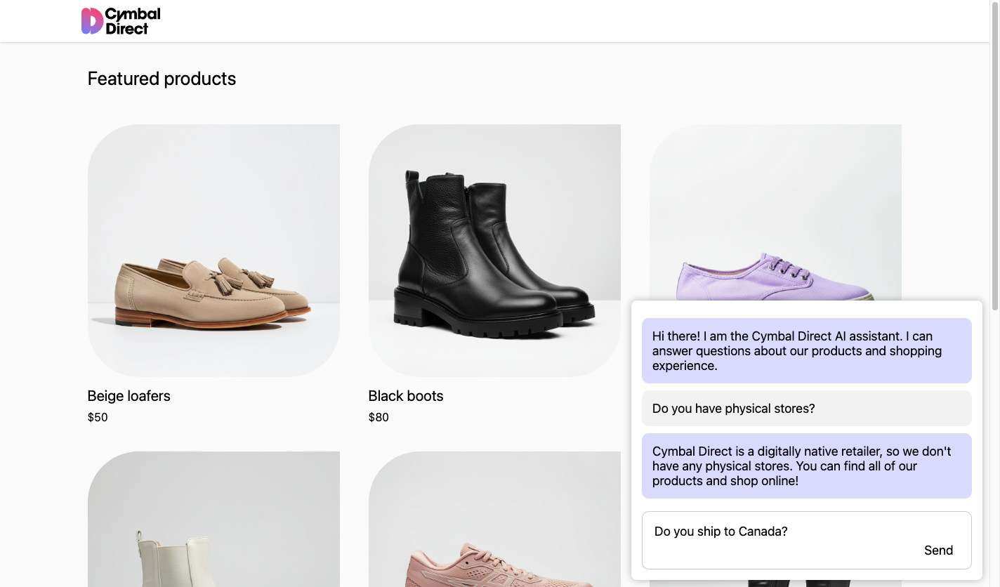
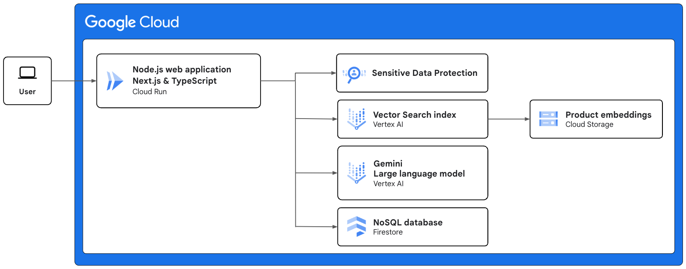

# Cymbal Direct

Cymbal Direct is a demo web application built using TypeScript and Next.js. It demonstrates Google Cloud technologies.

## Purpose of this app

The purpose of this demo application is to demonstrate Google Cloud products and best practices related to building an LLM (large language model) based chatbot agent.

## Achitecture diagram

This section describes the cloud architecture of Cymbal Direct, and how various Google Cloud products are pieced together.

* **Node.js web application** - The Node.js web application is written in TypeScript and uses the Next.js framework.
    This web application is containerized and deployed as a Cloud Run service.
    Users can access the web application through a web browser.
    Next.js is both a frontend framework and a backend framework, so there is no separate "backend" service or separate "frontend" service.
* **Sensitive Data Protection** - Sensitive information (such as credit card numbers) in users' messages is redacted (censored) before the messages are sent to a large language model (LLM) or stored in a database.
    For instance, if the user's message contains a credit card number, the number will be replaced with a string similar to "[CREDIT_CARD_NUMBER]".
    Redaction is done using Google Cloud's Data Loss Prevention (DLP) API.
* **Vector Search index** - The application uses a vector database (Vector Search index) to query for products related to the user's messages.
    For instance, if the users asks a question about winter boots, the vector database will return the product IDs of winter boots and similar shoes.
    The details of those products (including pricing) are included in the prompt sent to the large language model (LLM).
    This retrieval of query-related products and inclusion of those products' details in the prompt sent to the large language model (LLM) is known as retrieval augmented generation (RAG).
* **Product embeddings** - Before deployment, vector representations (embeddings) of each product (name, description, etc.) are generated using a text embeddings model on Vertex AI.
    Those embeddings are stored in Cloud Storage (as a JSONL file) and loaded into the Vector Search index.
* **Gemini** - The web app accesses the Gemini API through Vertex AI which hosts many other AI models.
    The web application uses Gemini's function calling feature to provide the Gemini model with access to JavaScript functions that can correctly extract status of customers' orders.
    If the user were to ask for a status update on their order, Gemini will ask the web application to invoke the JavaScript function.
* **NoSQL database** - Data such as conversations is stored in a Firestore database.

## Run on your machine

To run this app in development mode, you will need a [Google Cloud project](https://cloud.google.com/resource-manager/docs/creating-managing-projects) with billing enabled.

1. Using [Cloud console](https://console.cloud.google.com/firestore/databases), create the default Firestore database (titled `(default)`).
1. Run the Terraform inside `/terraform/` which will deploy some of the Google Cloud resources used by this app such as a Vector Search index. Instructions are in [/terraform/README.md](/terraform/README.md).
1. Using [Cloud console](https://console.cloud.google.com/vertex-ai/matching-engine/indexes), manually deploy your Vector Search index.
1. Run the Next.js app locally on your machine. Instructions are in [/nextjs-app/README.md](/nextjs-app/README.md).
