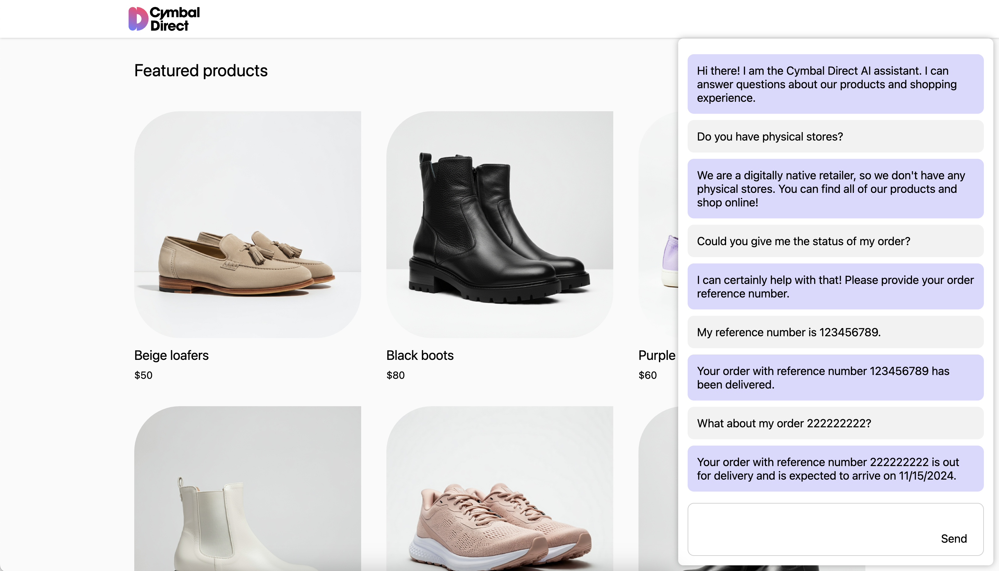

# Cymbal Direct

Cymbal Direct is a demo web application built using TypeScript and Next.js. It demonstrates Google Cloud technologies.

## Purpose of this app

The purpose of this demo application is to demonstrate Google Cloud products and best practices related to building an LLM (large language model) based chatbot agent.

